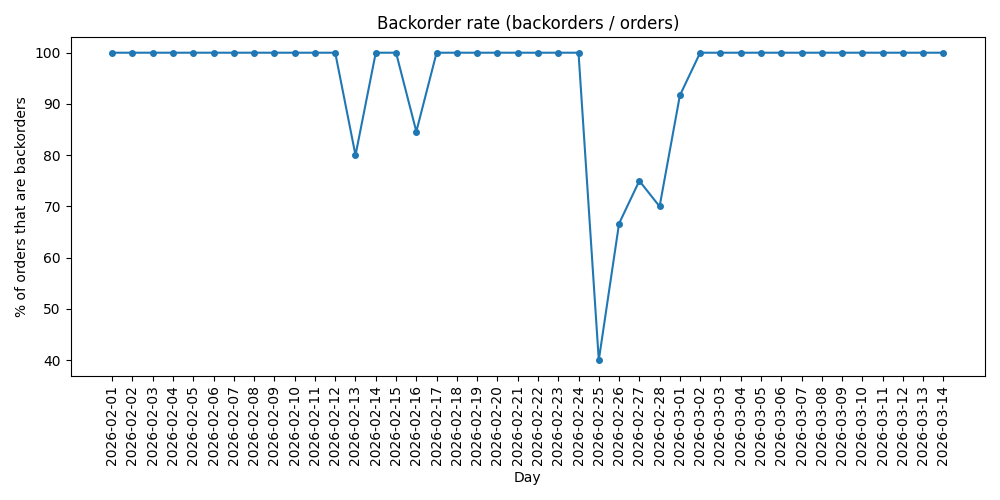
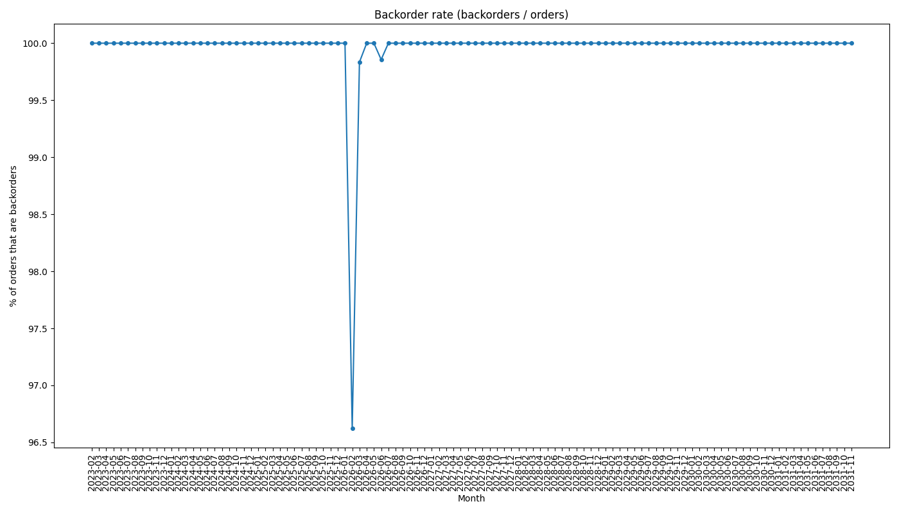
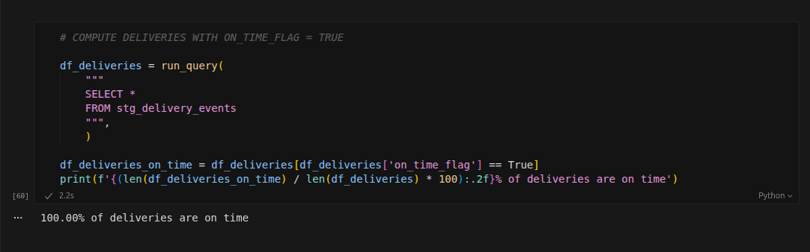
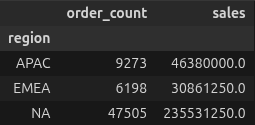
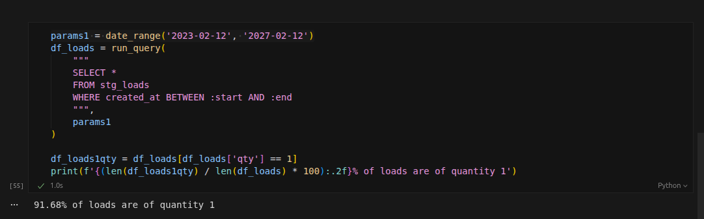
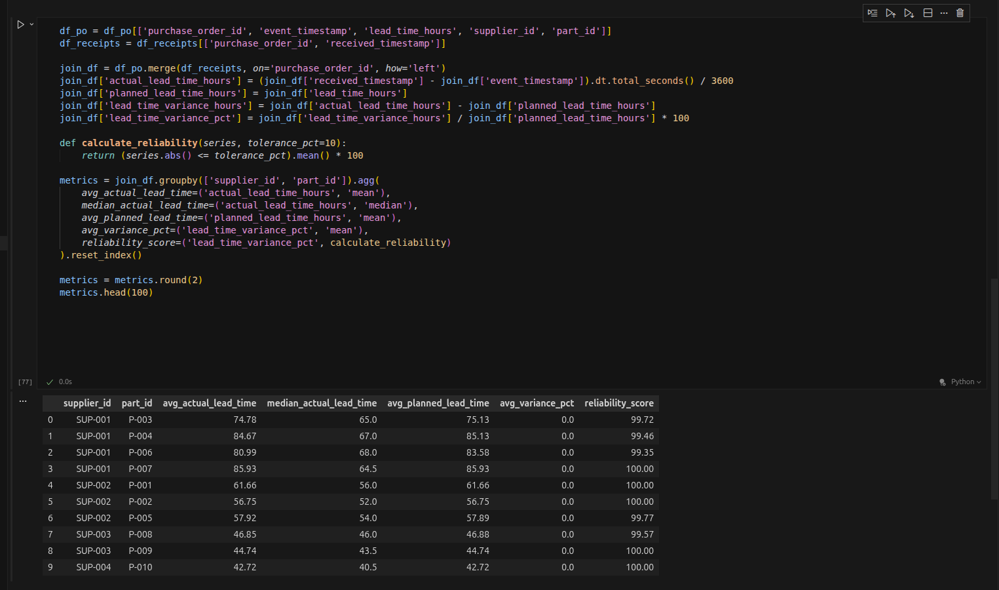
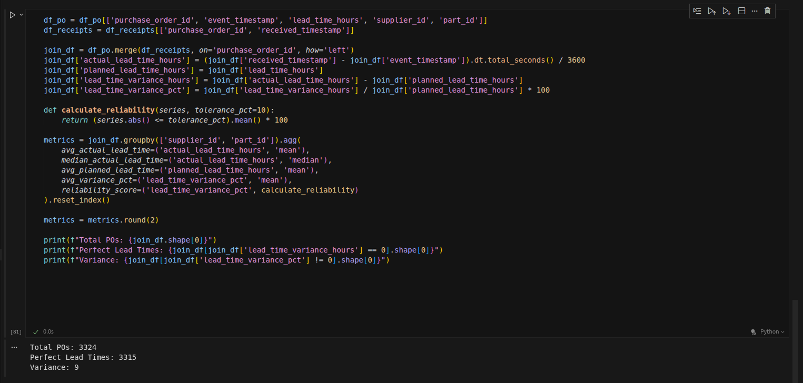
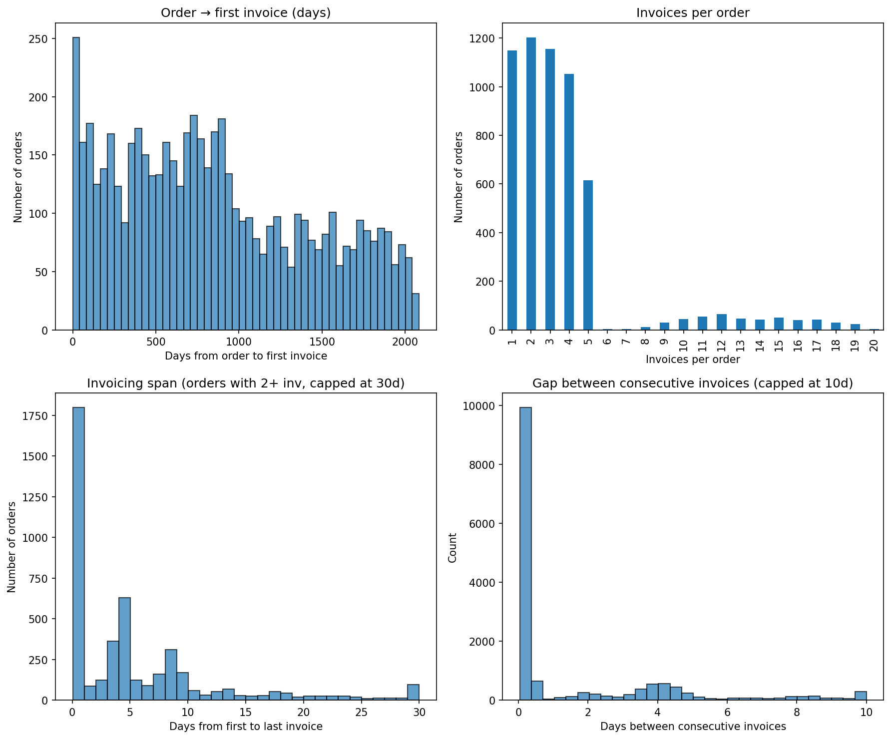
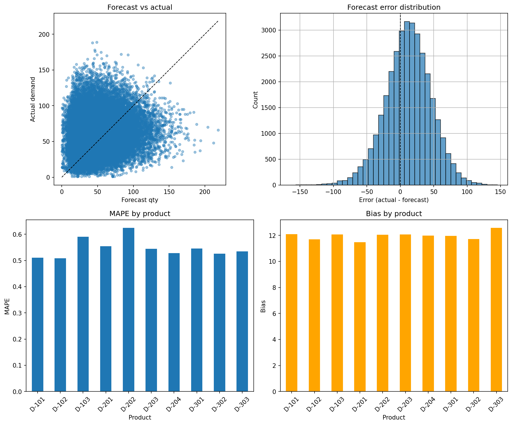
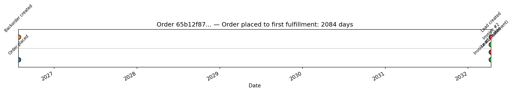

## 1. Backorder rate

**Finding:** Nearly 100% of orders become backorders.

**Evidence:** 

**Suggestion for simulation:** Reduce backorder rate.

---

## 2. Delivery timeliness

**Finding:** 100% of deliveries are on time (implausible).

**Evidence:** 

**Suggestion for simulation:** Introduce late deliveries (e.g. by route, carrier, or random delay).

---

## 3. Sales / region balance

**Finding:** NA dominates sales (and order count) vs APAC/EMEA.

**Evidence:**

**Suggestion for simulation:** Rebalance demand or capacity by region, or document that NA-heavy is intentional.

---

## 4. Load quantity

**Finding:** ~92% of loads have quantity 1.

**Evidence:** 

**Suggestion for simulation:** Increase consolidation (more orders per load) so load sizes are more realistic

---

## 5. Supply Lead Times

**Finding:** Every supplier is almost 100% reliable and the projected lead times match the actual ones.

**Evidence:**

**Suggestion for simulation:** Increase variance when it comes to supply lead times.

---

## 6. Order-to-invoice and multi-invoice fulfillment

**Finding:** Many orders are fulfilled and invoiced in multiple steps (partial backorder fulfillment). The **first** invoice for an order is issued on average **~851 days (~2.3 years)** after the order date (median 767 days, max 2,085 days). So in some cases, "time to first fulfillment" is effectively 2+ years, which is unrealistic and a major finding. Once invoicing starts, the last invoice follows within days (mean 5.5 days from first to last).

**Evidence:**
- **Invoices per order (5,666 orders with at least one invoice):** 20% have 1 invoice, 21% have 2, 20% have 3, 19% have 4, 11% have 5; the rest have 6–20 invoices (max 20 invoices for one order).
- **Order → first invoice:** Mean 851 days, median 767 days, max 2,085 days (time to first fulfillment).
- **Order → last invoice:** Mean 855 days, median 772 days, max 2,085 days (only ~5 days later than first on average).
- **For orders with 2+ invoices (4,517 orders):** Invoicing span (first to last invoice) mean 5.5 days, median 3.8 days, max 77 days; mean gap between consecutive invoices 1.6 days (median 0.17 days, max 29.6 days).

**Suggestion for simulation:** Cap or reduce order-to-first-invoice delay (e.g. align invoice timestamps with order/fulfillment logic so first invoice is issued within days or weeks of the order), or document why multi-year delay is intended.

**Raw metrics (section 6):**

*Invoices per order (number of orders with 1, 2, … invoices):*

| Invoices per order | Number of orders |
|--------------------|------------------|
| 1 | 1,149 |
| 2 | 1,203 |
| 3 | 1,156 |
| 4 | 1,053 |
| 5 | 616 |
| 6–10 | 3, 3, 12, 29, 44 |
| 11–15 | 55, 64, 46, 43, 50 |
| 16–20 | 41, 42, 30, 24, 3 |

*Order-to-first invoice (days):* count 5,666 · mean 850.8 · std 575.0 · min 0 · 25% 378.6 · 50% 766.7 · 75% 1,296.0 · max 2,084.7

*Order-to-last invoice (days):* count 5,666 · mean 855.2 · std 574.9 · min 0 · 25% 383.0 · 50% 771.9 · 75% 1,303.4 · max 2,084.8

*Invoicing span (days, orders with 2+ invoices):* count 4,517 · mean 5.54 · std 7.49 · min 0.04 · 25% 0.25 · 50% 3.83 · 75% 8.08 · max 77.0

*Gap between consecutive invoices (days):* count 15,234 · mean 1.64 · std 2.87 · min 0.04 · 25% 0.08 · 50% 0.17 · 75% 2.83 · max 29.63

*Mean gap between invoices (days), by invoice count:*

| Invoices per order | Mean gap (days) | Median gap (days) | Orders |
|--------------------|-----------------|-------------------|--------|
| 2 | 1.60 | 0.17 | 1,203 |
| 3 | 1.56 | 1.02 | 1,156 |
| 4 | 1.61 | 1.40 | 1,053 |
| 5 | 1.72 | 1.34 | 616 |
| 6 | 2.09 | 1.92 | 3 |
| 7 | 1.35 | 1.41 | 3 |
| 8 | 1.82 | 1.37 | 12 |
| 9 | 1.63 | 1.60 | 29 |
| 10 | 1.49 | 1.40 | 44 |
| 11 | 1.75 | 1.68 | 55 |
| 12 | 1.69 | 1.62 | 64 |
| 13 | 1.57 | 1.51 | 46 |
| 14 | 1.76 | 1.55 | 43 |
| 15 | 1.72 | 1.66 | 50 |
| 16 | 1.61 | 1.51 | 41 |
| 17 | 1.64 | 1.47 | 42 |
| 18 | 1.63 | 1.44 | 30 |
| 19 | 1.79 | 1.77 | 24 |
| 20 | 1.68 | 1.48 | 3 |

---

## 7. Demand forecasting performance

**Finding:** The demand forecasting model systematically underforecasts actual demand and has high relative error (MAPE ~51–63% by product). Every product shows positive bias (~11.5–12.5 units), so the model consistently predicts lower demand than what occurs.

**Evidence:**
- **Forecast vs actual:** Most points lie above the y=x line; actual demand often exceeds the forecast, especially at higher levels.
- **Error distribution:** The histogram of (actual − forecast) is shifted right of zero; mean error is positive, confirming underforecasting.
- **MAPE by product:** MAPE ranges from ~51% to ~63% across products; D-202 has the highest MAPE (~63%).
- **Bias by product:** All products have positive bias (~11.5–12.5 units); D-303 has the highest bias.

**Suggestion for simulation:** Recalibrate or replace the demand forecasting logic to reduce systematic underforecasting (e.g. adjust level or add bias correction) and to improve accuracy (e.g. better capture peaks and product-specific patterns). Prioritize products with highest MAPE (e.g. D-202) and highest bias (e.g. D-303) when tuning.

---

## 8. Order fulfillment delay (major finding)

**Finding:** **Orders take literal years to fulfill.** Nearly every order becomes a backorder (section 1), and when fulfillment finally happens — measured by the first invoice — it occurs on average **over 2 years** after the order (median ~2.1 years, max ~5.7 years). So in practice, customers wait years for their first shipment, which is unrealistic and a critical fulfillment finding.

**Evidence:**
- **Backorders:** Nearly 100% of orders become backorders, so almost no orders are fulfilled from stock; fulfillment is delayed by definition.
- **Time to first fulfillment (order → first invoice):** Mean **851 days (~2.3 years)**, median **767 days (~2.1 years)**, max **2,085 days (~5.7 years)**. At the 75th percentile, customers wait ~3.5 years for the first fulfillment.
- See section 6 and the order/invoice analysis (e.g. order_to_first_invoice_days, plot) for full metrics and multi-invoice detail.
- **Single-order timeline:** For the order with the longest time to first fulfillment (~2,084 days, ~5.7 years), a timeline of events shows order placed and backorder created at the start, then years later the first load, delivery, and first invoice occur in quick succession. This illustrates that fulfillment events are clustered years after the order with no intermediate activity in between.

**Suggestion for simulation:** Treat fulfillment delay as a core parameter: align order fulfillment (and first-invoice) timing with order date so that time-to-first-fulfillment is in days or weeks, not years (e.g. cap or rescale the delay, or fix the event logic that drives invoice timestamps).

# 9. Simulation Codebase Analysis & Recommendations

## Overview
An analysis of the `repomix-output.txt` codebase alongside the data findings reveals that the "death spiral" in the inventory logic is the primary driver of the 2-year fulfillment delays. The system calculates reorders based on **on-hand** inventory while ignoring the growing mountain of **backorders**, preventing the simulation from ever catching up.

Below are the specific root cause analyses and recommendations for the upcoming update.

---

## 1. Root Cause of 2-Year Fulfillment Delays (Critical)

**Finding:** Orders take ~850 days to fulfill because the system is stuck in a permanent backlog.

**Code Diagnosis:**
- **Initialization:** `scripts/generate_inventory.py` initializes finished goods (D-101 to D-303) with `finishedproductqty` defaulting to 0. This guarantees every simulation starts in a deficit.
- **Reorder Logic:** The `checkreorderpoints` logic in `scripts/world_engine.py` triggers replenishment when `On Hand < Reorder Point`.
- **The Flaw:** The reorder quantity formula likely calculates `Target Max - On Hand`. It ignores **Backorders**.
    - *Scenario:* If you have 0 stock and 2,000 backorders, the system orders only enough to reach `Target Max` (e.g., 1,000 units). When those 1,000 arrive, they are immediately consumed by the first 1,000 backorders. Stock returns to 0, and the remaining 1,000 backorders wait for the *next* cycle. This creates a permanent, rolling backlog.

**Suggestion for Developer:**
1.  **Fix Initialization:** Update `scripts/generate_inventory.py` to seed finished goods inventory (e.g., `mean_daily_demand * 7 days`) so the simulation starts healthy.
2.  **Fix Reordering Formula:** Update `scripts/world_engine.py` to use **Net Inventory Position**.
    - *Current:* `if OnHand < ReorderPoint`
    - *Required:* `if (OnHand + IncomingSupply - Backorders) < ReorderPoint`
3.  **Increase Order Quantity:** The replenishment quantity must be `TargetMax - (OnHand + IncomingSupply - Backorders)`. This ensures that if the system is 2,000 units behind, it orders enough to cover the debt *plus* restock the shelf.

---

## 2. Unrealistic Delivery Perfection

**Finding:** 100% of deliveries are on time, which is statistically impossible.

**Code Diagnosis:**
- In `scripts/world_engine.py`, the `processpendingdeliveries` function likely compares `ActualArrival` vs. `ScheduledArrival`.
- The `deliverytransitdelaymaxhours` config (12 hours) is likely too small to trigger a "late" flag if the delivery window is measured in whole days, or it is being added to *both* the schedule and the actual time (neutralizing the delay).

**Suggestion for Developer:**
- **Inject Variance:** Separate the *Scheduled* transit time (based on `typicaltransitdays` in `routes.json`) from the *Actual* transit time.
- **Stochastic Delays:** Add a probability (e.g., 5%) of a "disruption event" that adds 24–72 hours to the *Actual* time, explicitly causing it to exceed the *Scheduled* time.

---

## 3. Load Consolidation (LTL Dominance)

**Finding:** ~92% of loads have a quantity of 1, driving up costs and incorrectly modeling logistics.

**Code Diagnosis:**
- The system currently uses a "Direct Ship" logic: `Order -> Invoice -> Ship`.
- As soon as a single backordered unit becomes available (often 1 unit due to the scarcity mentioned in point #1), the system calls `createloadandscheduledelivery` immediately.

**Suggestion for Developer:**
- **Implement Consolidation:** Create a "Staging" status. When an order is fulfilled, move it to `Ready for Shipping`.
- **Batch Processing:** Run a daily job that groups all `Ready` items by `Destination Facility`. Only create a `Load` when:
    1.  The truck is full (weight/volume limit), OR
    2.  The oldest order in the group has waited > X days (Time-based flush).

---

## 4. Regional Imbalance (NA Dominance)

**Finding:** North America dominates sales, distorting the "Global" nature of the simulation.

**Code Diagnosis:**
- `scripts/generate_customers.py` contains a hardcoded list of 15 customers.
- 12 of the 15 customers (`CUST-001` to `CUST-006`, `CUST-008` to `CUST-013`) are located in the US. Only 3 customers represent the rest of the world (Dubai, Netherlands, Singapore).

**Suggestion for Developer:**
- **Diversify Customers:** Update `generate_customers.py` to generate 50+ customers using a weighted distribution (e.g., 40% NA, 30% EMEA, 30% APAC) to ensure realistic regional demand.

---

## 5. Forecasting Accuracy

**Finding:** The forecast consistently underestimates demand with a high error rate (MAPE ~60%).

**Code Diagnosis:**
- The forecasting logic (likely Moving Average in `world_engine.py`) is likely training on **Sales History** (Invoiced items) rather than **Demand History** (Ordered items).
- Because stock is always 0, "Sales" are capped by supply constraints. The model sees low sales numbers and predicts low demand, causing the system to order less stock, perpetuating the shortage.

**Suggestion for Developer:**
- **Forecast on Demand:** Ensure the forecasting model inputs use `Order Date` and `Original Qty` (True Demand), not `Invoice Date` and `Shipped Qty` (Constrained Supply).
- **Bias Correction:** If the model assumes a 0-trend but demand is growing, add a simple trend component (e.g., Holt’s Linear Trend) to capture the upward trajectory.

---

## Summary of Priority Fixes

| Priority | Component | Action Item |
| :--- | :--- | :--- |
| **Critical** | **Inventory** | **Fix Reorder Logic:** Include `Backorders` in the reorder trigger formula to stop the 2-year delay death spiral. |
| **High** | **Initialization** | **Pre-seed Inventory:** Set non-zero starting stock for finished goods in `generate_inventory.py`. |
| **Medium** | **Logistics** | **Load Consolidation:** Stop shipping single units; batch orders by destination before creating loads. |
| **Medium** | **Customers** | **Expand Dataset:** Replace hardcoded 15 customers with a generated list of 50+ balanced globally. |
| **Low** | **Delivery** | **Add Chaos:** Inject random multi-day delays in the delivery phase to break the 100% on-time streak. |
